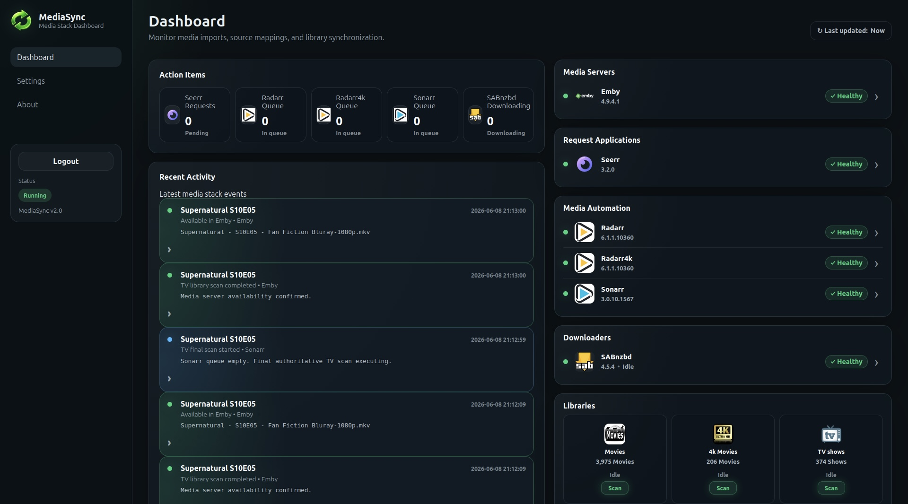
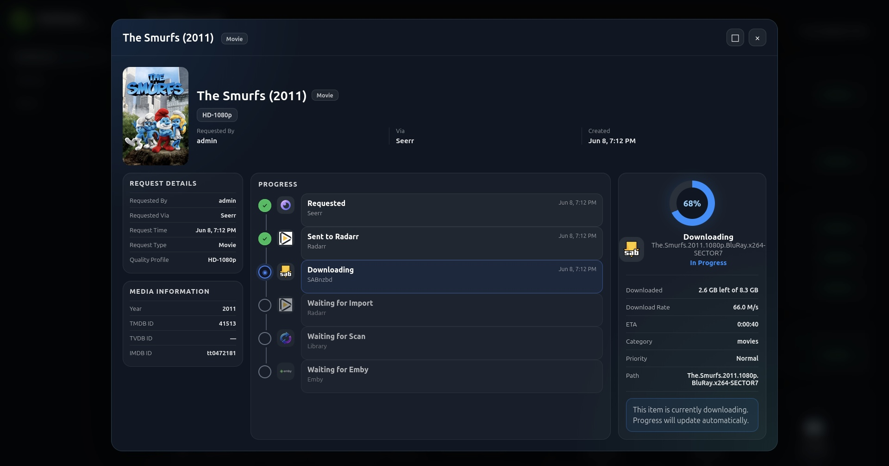
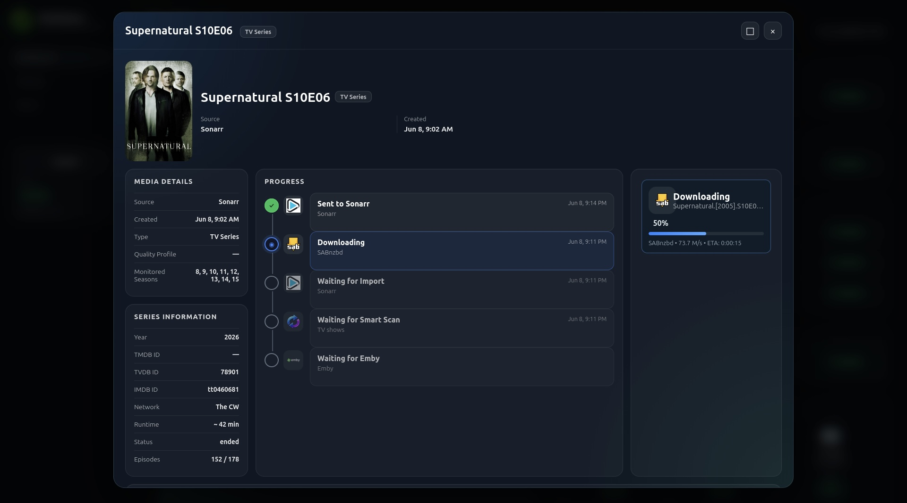

<p align="center">
  
  
  
  
</p>

<h1 align="center">MediaSync</h1>

<p align="center">
  <strong>Media Server Automation and Visibility</strong>
</p>

<p align="center">
  MediaSync connects Seerr, Radarr, Sonarr, SABnzbd, and your media server into a single dashboard.
  Track requests from download to availability, monitor the health of your media stack, and automatically
  keep Emby, Jellyfin, and Plex libraries in sync.
</p>

<p align="center">
  <strong>Request Tracking</strong> •
  <strong>Download Visibility</strong> •
  <strong>Service Health Monitoring</strong> •
  <strong>Smart TV Sync</strong> •
  <strong>Emby / Jellyfin / Plex</strong>
</p>

---

## Screenshots

### Dashboard



The dashboard gives you a live view of your media stack.

Features include:

- Service health monitoring
- Request visibility
- Queue visibility
- Download activity
- Library counts
- Recent activity
- Manual scan controls

### Movie Progress Tracking



Track a movie through the entire media pipeline:

```text
Requested
↓
Sent to Radarr
↓
Downloading
↓
Imported
↓
Library Scan
↓
Available in Emby
```

The movie progress window provides:

- Live download percentage
- Import detection
- Scan tracking
- Availability confirmation
- Request details
- Media metadata

### TV Progress Tracking



Track TV episodes through the media pipeline:

```text
Requested
↓
Sent to Sonarr
↓
Downloading
↓
Imported
↓
Smart Scan
↓
Available in Emby
```

The TV progress window provides:

- Live download tracking
- Queue visibility
- Episode tracking
- Smart scan status
- Availability confirmation
- Series information

---

## Features

### Request Tracking

MediaSync tracks requests from Seerr all the way through download, import, scan, and availability.

### Download Visibility

Monitor SABnzbd activity directly from MediaSync, including live progress percentages and download status.

### Immediate Movie Scans

Movie imports trigger immediate library scans so new content appears quickly.

MediaSync verifies that content is actually available in your media server before reporting completion.

### Queue Aware TV Synchronization

TV imports are handled differently than movies.

MediaSync performs an immediate scan on the first import, monitors the Sonarr queue, performs optional interim scans during active download sessions, and executes a final authoritative scan when the queue becomes empty.

This keeps content available quickly without creating unnecessary scan spam during large download batches.

### Service Health Monitoring

MediaSync monitors the health of connected services and displays status directly on the dashboard.

Status indicators include:

- Healthy
- Update Available
- Configuration Warnings
- Connection Failures

Supported services:

- Emby
- Jellyfin
- Plex
- Seerr
- Radarr
- Sonarr
- SABnzbd

MediaSync supports multiple instances of supported applications.

### Library Statistics

Monitor library totals directly from the dashboard.

Examples:

- Movies
- 4K Movies
- TV Shows

Library counts update automatically after successful scans.

### Live Activity Feed

Track events including:

- Requests
- Downloads
- Imports
- Movie scans
- TV smart scans
- Availability confirmation
- Manual scans
- Service events

### Authentication

MediaSync includes first run account setup and session based authentication.

### Progressive Web App

MediaSync can be installed directly to mobile devices and used like a native application.

---

## Supported Integrations

### Request Applications

- Seerr

### Media Automation

- Radarr
- Sonarr

Multiple instances of Radarr and Sonarr are supported.

### Download Clients

- SABnzbd

### Media Servers

- Emby
- Jellyfin
- Plex

---

## Deployment

MediaSync is designed to run as a Docker container.

Example:

```yaml
version: '3.8'

services:
  mediasync:
    image: ghcr.io/dmesgnoise/mediasync:latest
    container_name: mediasync
    restart: unless-stopped
    ports:
      - "8097:8097"
    volumes:
      - mediasync_config:/config

volumes:
  mediasync_config:
```

Build locally:

```bash
docker compose up -d --build
```

---

## Roadmap

### MediaSync 2.1

- Unmanic integration
- Tdarr integration
- Space savings tracking
- Transcoding visibility

### Future

- Additional download clients
- Additional request applications
- Notifications
- Analytics

---

## License

MediaSync is licensed under the GNU Affero General Public License v3.0.

See LICENSE for details.
