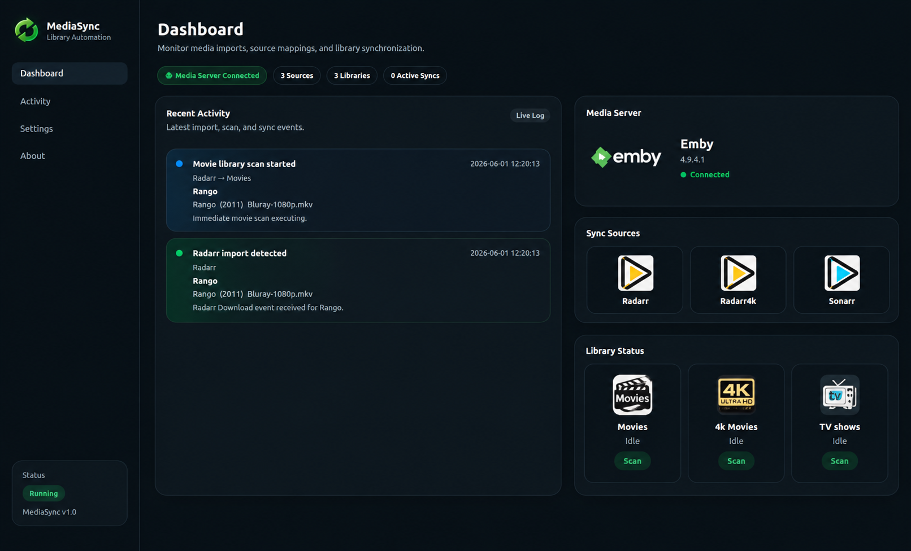
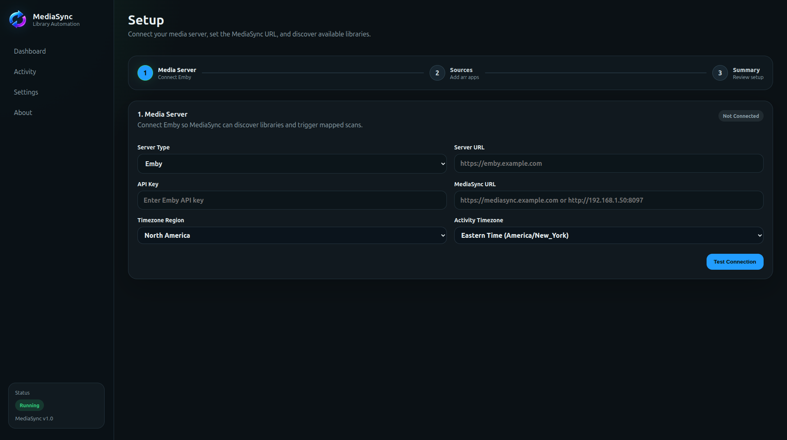

<p align="center">
  
  
  
  
</p>

<h1 align="center">MediaSync</h1>

<p align="center">
  <strong>Library Automation</strong>
</p>

<p align="center">
  MediaSync keeps your media stack responsive by connecting acquisition tools directly to your media server.
  Movies scan immediately, TV imports are handled with queue-aware smart sync, and live activity monitoring keeps
  library updates visible without app-hopping.
</p>

<p align="center">
  <strong>Immediate Movie Scans</strong> •
  <strong>Queue-Aware TV Sync</strong> •
  <strong>Smart Library Mapping</strong> •
  <strong>Live Activity Monitoring</strong>
</p>

---

## What MediaSync Does

MediaSync connects your Arr stack to your media server so newly imported content appears quickly and reliably.

Instead of waiting for scheduled media-server scans or manually refreshing libraries, MediaSync listens for completed imports from Radarr and Sonarr, then triggers the correct mapped media-server library scan automatically.

It is designed for real homelab media workflows where responsiveness matters, but scan spam does not.

---

## Features

### Immediate Movie Scans

Movie imports trigger immediate mapped library scans.

When Radarr reports a completed movie import, MediaSync scans the mapped movie library right away so new movies become available quickly.

### Queue-Aware TV Sync

TV imports use smart queue-aware behavior.

MediaSync avoids hammering the media server during large episode batches while still making new content available quickly.

TV sync behavior:

```text
First TV import
→ immediate mapped library scan
→ Sonarr queue monitoring begins
→ interim scans run according to user settings while the queue remains active
→ queue empty
→ one final authoritative mapped library scan
```

This is ideal for season packs, multi-episode imports, and sustained download activity.

### Smart Source → Library Mapping

MediaSync maps each source to the correct media-server library.

Examples:

```text
Radarr → Movies
Sonarr → TV Shows
```

Multiple source instances are supported, so users can map different Radarr or Sonarr instances to different libraries without special-case configuration.

### Live Activity Monitoring

The dashboard and activity page provide real-time visibility into import and scan behavior.

Track events such as:

- source imports
- immediate movie scans
- TV smart scan starts and updates
- queue monitoring
- interim scans
- final scans
- scan failures
- manual scans

Activity timestamps follow the configured timezone, and file display can be switched between filenames and full paths.

### First-Run Setup and Ongoing Settings

MediaSync uses a mandatory first-run setup flow.

Once setup is complete, the Settings page becomes the canonical place to manage:

- media server connection
- MediaSync webhook URL
- source connections
- source testing
- library mapping
- TV sync behavior
- activity display behavior
- manual reset/recovery

Configured systems cannot return to setup unless configuration is reset.

---

## Supported Integrations

### Current

Media server:

- Emby

Sources:

- Radarr
- Sonarr

### Planned

Media servers:

- Plex
- Jellyfin

Pipeline and processing:

- downloader tracking and queue visibility
- Unmanic integration
- transcoding status
- storage optimization insight
- real-time space savings feedback

---

## Long-Term Vision

MediaSync is evolving toward full media pipeline visibility.

Target workflow:

```text
Seerr → Arr → Downloader → Arr → MediaSync → Media Server
```

The long-term goal is a single pane of glass for the full media automation pipeline, including:

- who requested media
- Arr queue state
- downloader progress and timers
- import status
- media-server scan status
- processor/transcoding state
- storage savings insight

MediaSync aims to reduce app-hopping and make the entire media workflow easier to understand at a glance.

---

## Screenshots

Screenshots will be added after the first clean deployment validation.

### Dashboard

Monitor imports, activity, source mappings, and library synchronization in real time.

<p align="center">
  
</p>

### Guided Setup

Connect your media server, discover libraries, configure sources, and map automation workflows in minutes.

<p align="center">
  
</p>

---

## Deployment

MediaSync is designed to run as a Docker container.

A typical deployment uses Docker Compose or a Portainer stack.

Example Compose file:

```yaml
version: '3.8'

services:
  mediasync:
    image: ghcr.io/dmesgnoise/mediasync:latest
    container_name: mediasync
    restart: unless-stopped
    ports:
      - "8097:8097"
    volumes:
      - mediasync_config:/config

volumes:
  mediasync_config:
```

For local development or self-building:

```bash
docker compose up -d --build
```

After deployment:

1. Open the MediaSync web UI.
2. Complete first-run setup.
3. Configure the MediaSync URL used for webhook registration.
4. Add Radarr and/or Sonarr sources.
5. Test each source.
6. Select compatible media-server libraries.
7. Save mappings.
8. Trigger an import and confirm activity appears in the dashboard.

---

## Notes

MediaSync should be reachable by Radarr and Sonarr at the configured MediaSync URL so webhook registration can work correctly.

If using a reverse proxy, configure the MediaSync URL with the externally reachable address, for example:

```text
https://mediasync.example.com
```

or a local network address:

```text
http://192.168.1.50:8097
```

---

## License

MediaSync is licensed under the GNU Affero General Public License v3.0.

See [`LICENSE`](LICENSE) for details.

The AGPLv3 ensures MediaSync and modified versions remain open source, including when modified versions are run as network services.
